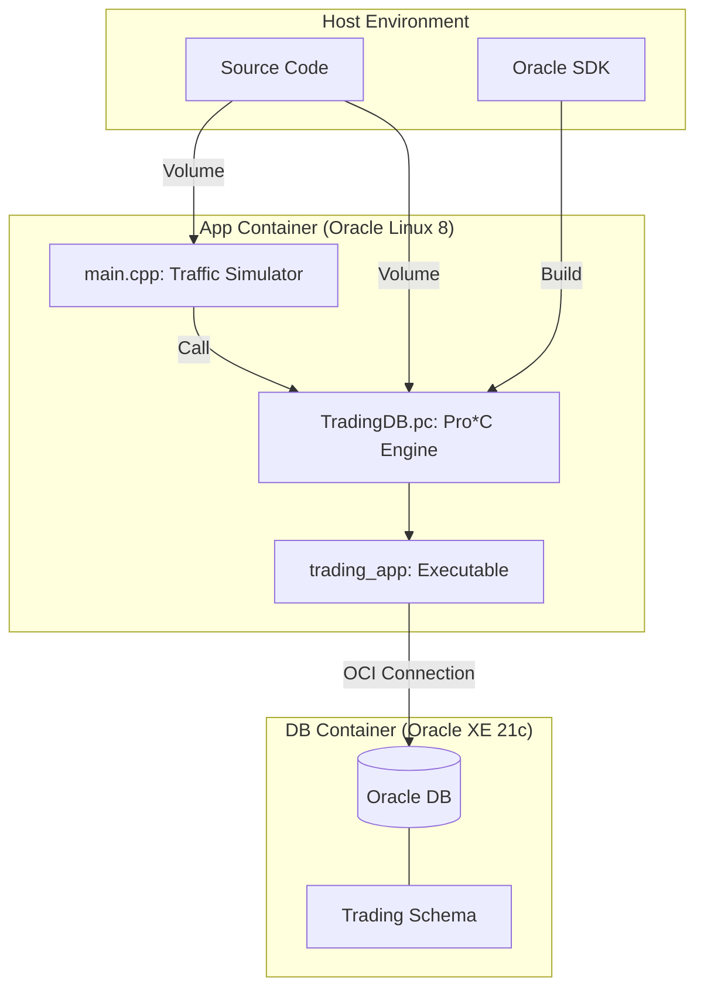

# System Architecture

Digitied 프로젝트의 전체 시스템 구조와 데이터 흐름을 설명합니다.

## 1. 전체 아키텍처 (System Components)

이 시스템은 Docker를 활용하여 애플리케이션 환경과 데이터베이스 환경을 격리하며, Pro*C를 통해 고성능 DB I/O를 실현합니다.

## 2. 모듈별 역할
- **App Container:** C++17 빌드 환경과 Oracle Instant Client가 설정되어 있으며, Pro*C 프리컴파일러를 사용하여 SQL 로직을 처리합니다.
- **DB Container:** Oracle XE 21c가 실행되며, 초기화 스크립트를 통해 거래 테이블과 유저 정보가 생성됩니다.
- **Oracle SDK:** DNF 설치의 한계를 극복하기 위해 프로젝트에 직접 포함된 Pro*C 라이브러리 및 헤더 모음입니다.

---

## 3. 기술 스택
| 구분 | 기술 |
| :--- | :--- |
| 언어 | C++17, Pro*C |
| DB | Oracle XE 21c |
| 인프라 | Docker, Docker Compose |
| 빌드 | GNU Make |
