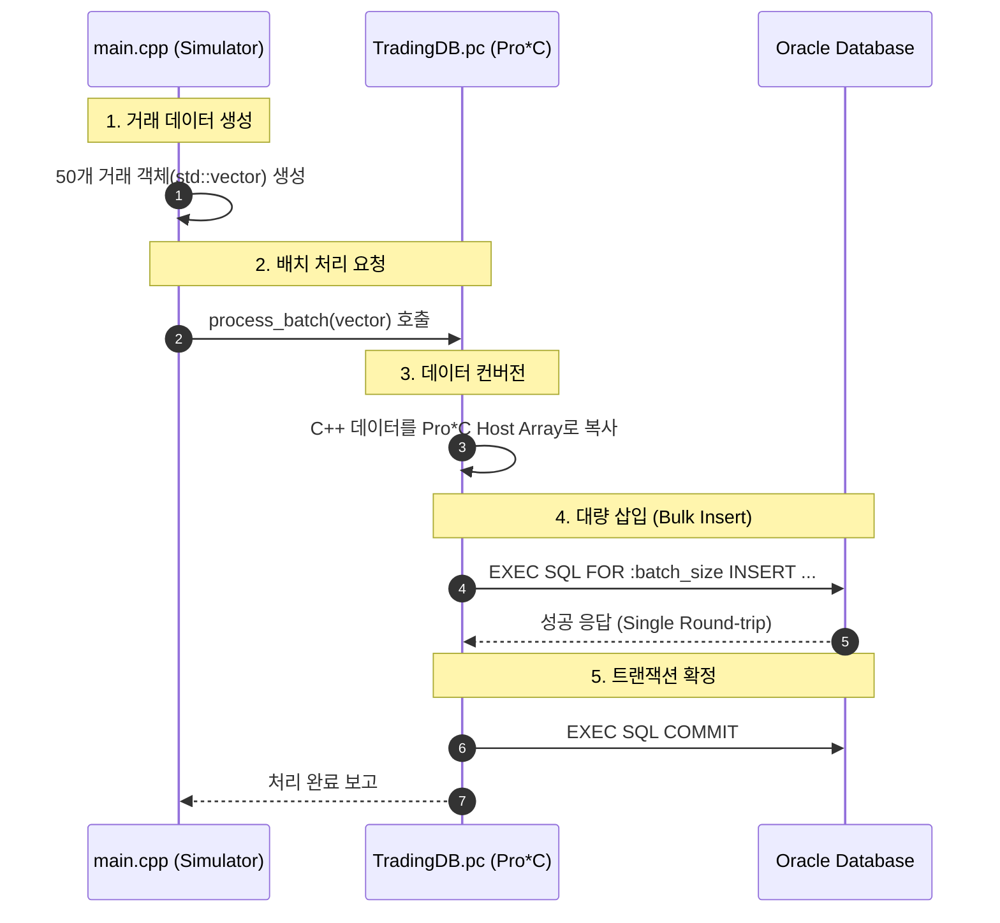

# Data Flow & Batch Processing

시스템의 핵심 로직인 대량 트래픽 처리 흐름을 설명합니다.

## 1. 거래 처리 흐름 (Transaction Flow)

가상의 트래픽이 발생하여 데이터베이스에 저장되기까지의 과정입니다.

## 2. 핵심 고성능 기법: Host Arrays
본 프로젝트는 하나씩 INSERT를 수행하는 대신, 오라클의 **Host Arrays** 기능을 사용합니다.

- **기존 방식:** 50번의 네트워크 통신(Round-trip) 발생
- **Batch 방식:** 1번의 네트워크 통신으로 50개 데이터 전송
- **효과:** 네트워크 레이턴시 감소, CPU 컨텍스트 스위칭 비용 절감, DB 부하 감소

---

## 3. 예외 처리
- **SQL Error 발생 시:** `handle_sql_error()` 함수가 호출되며, `ROLLBACK`을 수행하여 데이터 무결성을 보장합니다.
- **Connection Loss:** 연결 실패 시 에러 로그를 출력하고 프로그램을 안전하게 종료합니다.
